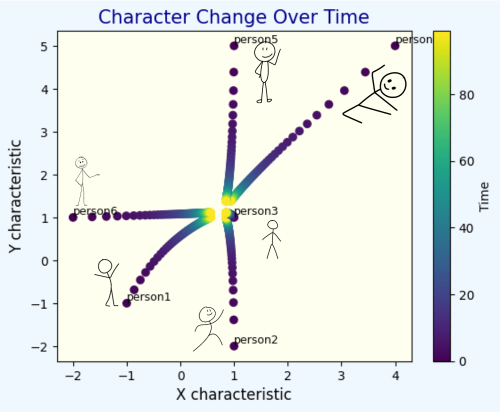
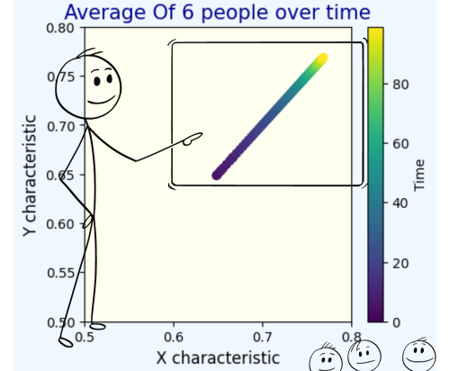

# Average of 5 people
Visualization: Change of human characteristics in masses in relation to quote: "You are the average of the five people you spend the most time with."

## Intuition

If person's characteristic are completely specified by their friends, then nobody will have characteristics relative to each other - Only possible way in which this is true is if everybody has the same characteristics.

For example: if there is closed system of 6 friends, whatever we initialize for their traits, that will be instantly overwritten with average of group.

## Visualisation
- We can assume that characteristics of people can change slowly in time, with some constant speed that is in range from 0 to 1 (0 - change is not possibel, 1 - after one iteration everyone will be at average)
- Also we can assume that people that are outliers can change relatively faster that those close to average.

- Also with this assamptions we see that avarage varies throughout time, it goes to location where most people are in the beggining

